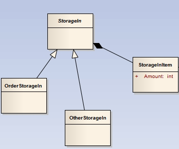
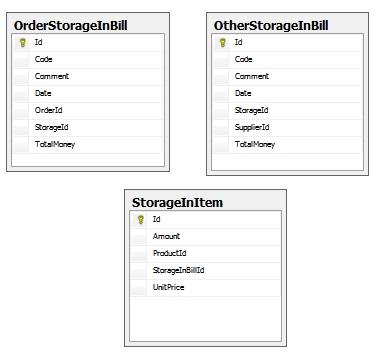

##概念
在 ORM 框架中，领域实体与数据表的映射往往是一对一的。但是面向对象的特性之一是支持继承，继承不但可以支持代码重用，更是另一特性多态的基础。所以支持继承的映射，对于面向对象的实体设计来说，是非常必要的。
一般而言，拥有继承关系的几个实体类，映射到数据库表的方式有以下三种：
 - Table Per Hierarchy (TPH)：整个继承树中的所有实体都映射同一张表。
 - Table Per Type (TPT)：继承树中的包括父类与子类在内的每一个类型都映射一张单独的表。
 - Table Per Concrete Class (TPC)：继承树中叶子结点上的具体子类型才映射单独的数据表。

  关于这三种映射方式的具体介绍，网上比较多。以下是 MS ADO.NET 团队博客中的文章，可以从中详细了解：《[Inheritance Mapping](http://blogs.msdn.com/b/adonet/archive/2010/10/26/10080555.aspx)》

##Rafy 实体继承
目前框架中只支持 TPC、TPH 两种模式，不支持 TPT。而且建议使用 TPC 映射。接下来，使用以下模型作为示例：
**领域模型**



##TPC 配置
优点：

简单。建议使用。

缺点：

当需要对基类统一查询时，较为麻烦，需要使用手动 SQL 完成。       

 数据库中没有外键约束，需要使用代码同步。

配置方法：
    把基类 StorageIn 设置为 abstract 类，则基类不会生成表。
    同时两个子类 OrderStorageIn 和 OtherStorageIn 分别设置为映射所有字段。这时，由于它们继承了基类的所有属性，所以它们分别生成了它们自己的表。
    同时，StorageInItem 的外键则完全失效，也不会自动的级联删除。如图：
**TPC 表结构 **



这时，我们需要在代码中主动添加级联删除，如 StorageIn 的 OnDelete 方法中加入以下代码：

```cs
protected override void OnDelete()
{
    base.OnDelete();

    //由于本类没有映射数据表，所以在删除的时候需要删除下面的数据
    using (var db = this.CreateDb())
    {
        db.Delete(typeof(StorageInBillItem), db.Query(typeof(StorageInBillItem))
            .Constrain(StorageInBillItem.StorageInBillRefProperty).Equal(this.Id)
            );
    }
}
```


##TPH 配置
优点：对基类进行统一的查询时较为方便。  
缺点： 要为所有子类的查询都添加分辨类型字段的过滤。  
配置方法：首先，StorageIn 不设置为抽象类，同时两个子类 OrderStorageIn 和 OtherStorageIn 分别设置为映射所有字段，并显式指定映射到基类的表上，即：
Meta.MapTable("StorageIn").MapAllPropertiesToTable();
  这时，生成表如下：
**TPH 表结构 **


外键及所对应的级联删除都存在，比较简单。
这样，包括两个子类的所有的字段都存放在基类的表 StorageIn 中。也就是说，这种模式下，需要两个子类添加的新字段都是可以为空的，否则会造成其它的类型无法插入。
同时，由于两个类的数据都存储在同一张表里，所以数据需要添加一个单独的字段进行分辨，例如：在 StorageIn 上添加属性 Descrimilator，然后，在子类中分别为该属性设置不同的默认值：

```cs
[RootEntity, Serializable]
public class OtherStorageIn : StorageIn
{
    public static readonly string DescriminatorName;

    static OtherStorageIn()
    {
        DescriminatorName = "OtherStorageIn";
        DescriminatorProperty.OverrideMeta(typeof(OtherStorageIn), new ManagedPropertyMetadata<string>
        {
            DefaultValue = DescriminatorName
        });
    }
}
```

以及：

```cs
[RootEntity, Serializable]
public class OrderStorageIn : StorageIn
{
    public static readonly string DescriminatorName;

    static OrderStorageIn()
    {
        DescriminatorName = "OrderStorageIn";
        DescriminatorProperty.OverrideMeta(typeof(OrderStorageIn), new ManagedPropertyMetadata<string>
        {
            DefaultValue = DescriminatorName
        });
    }
}
```

这样，这两个子类存储在数据库中的数据的该字段就分别有了不同的值。然后在查询时，分别对该字段进行过滤即可，例如：

```cs
[Serializable]
public class OrderStorageInList : StorageInList
{
    protected override void OnGetAll()
    {
        this.QueryDb(q => q.Constrain(StorageIn.DescriminatorProperty).Equal(OrderStorageIn.DescriminatorName));
    }
}
```


##注意
 - 继承后，只支持直接对具体的子类的查询，不支持对抽象父类的查询。也就是说，不支持查询出一个父类的实体列表，列表中的元素，一部分是子类 A 的对象，另一部分则是子类 B 的对象。
 - 子实体继承了父实体后，其对应的子实体集合、子实体仓库也必须从父实体集合及父实体仓库继承。
